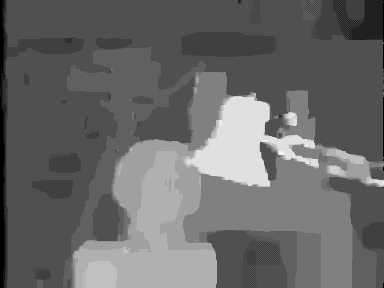

# Stereo Matching using Belief Propagation
A Matlab implementation of Loopy Belief Propagation for stereo matching. It includes the "Sum-Product", "Max-Product" and "Min-Sum" versions of the algorithm and uses the "Synchronous" message update schedule.

## Input Image
The Tsukuba stereo image that used as input.

   

## Output Image
The disparity map that created at the output using the "Sum-Product" version.

   

The disparity map that created at the output using the "Max-Product" version.

   

The disparity map that created at the output using the "Min-Sum" version.

   

## Related Repositories

- [Belief Propagation for Stereo Matching (Sum-Product)](https://github.com/bollasap/belief-propagation-for-stereo-matching-sumproduct)
- [Belief Propagation for Stereo Matching (Max-Product)](https://github.com/bollasap/belief-propagation-for-stereo-matching-maxproduct)
- [Belief Propagation for Stereo Matching (Min-Sum)](https://github.com/bollasap/belief-propagation-for-stereo-matching-minsum)
